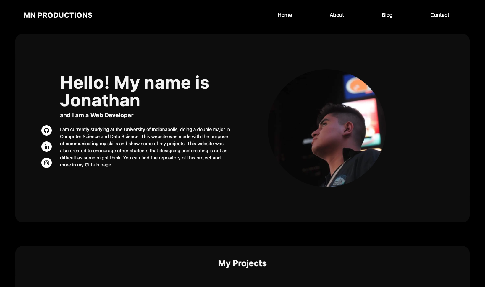

## Portfolio Website

The website I created is a demonstration of my skills in web development. I used
a variety of technologies to build it, including Next.js for the framework,
Tailwind CSS for the styling, Node.js for the backend, and GitHub for version
control and collaboration. The website showcases my ability to work with these
technologies to create a functional and visually appealing website. I have
designed and developed the website to be responsive and user-friendly, making it
easy for visitors to navigate and find the information they need. Overall, the
website serves as a portfolio of my web development skills and experience.

I will be constantly trying to improve the design and the code. If you have any
suggestions, please either contact me through my social media or make a pull
request.



### Download the project

Clone the repository:

```
git clone https://github.com/JonathanJT109/jonathanjt109.github.io.git
```

And download the packages and dependencies:

```
npm install
```

Finally, run the project:

```
npm run dev
```

### Social Media

**Email:** jonathangon.2014@gmail.com

**Instagram:** @jonathanjt109
